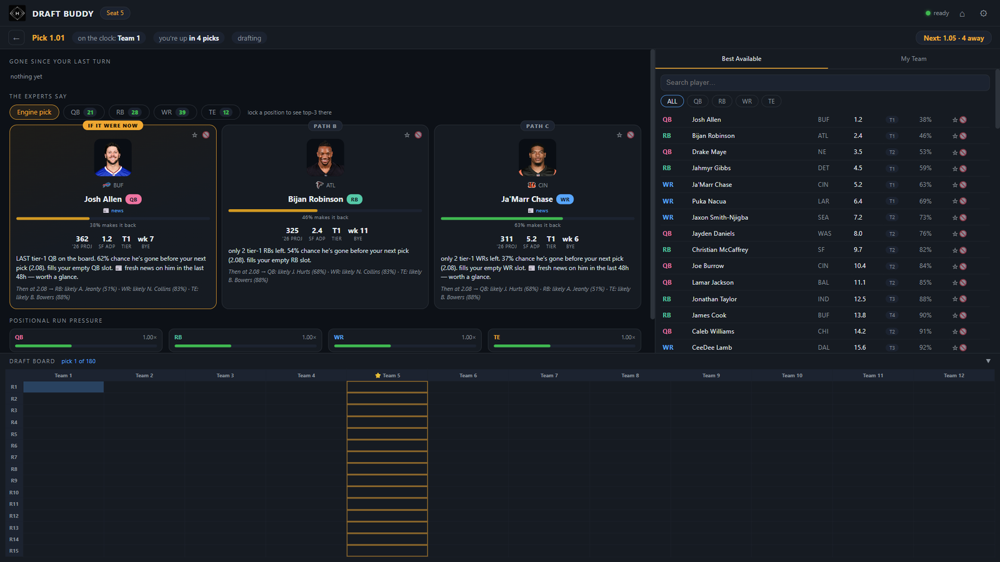
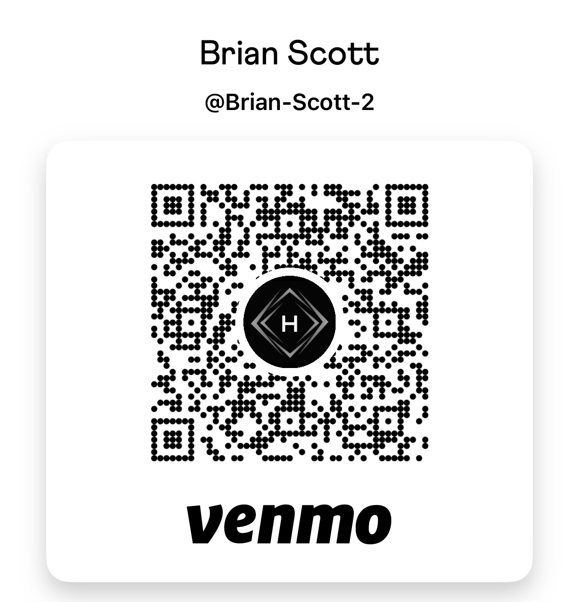
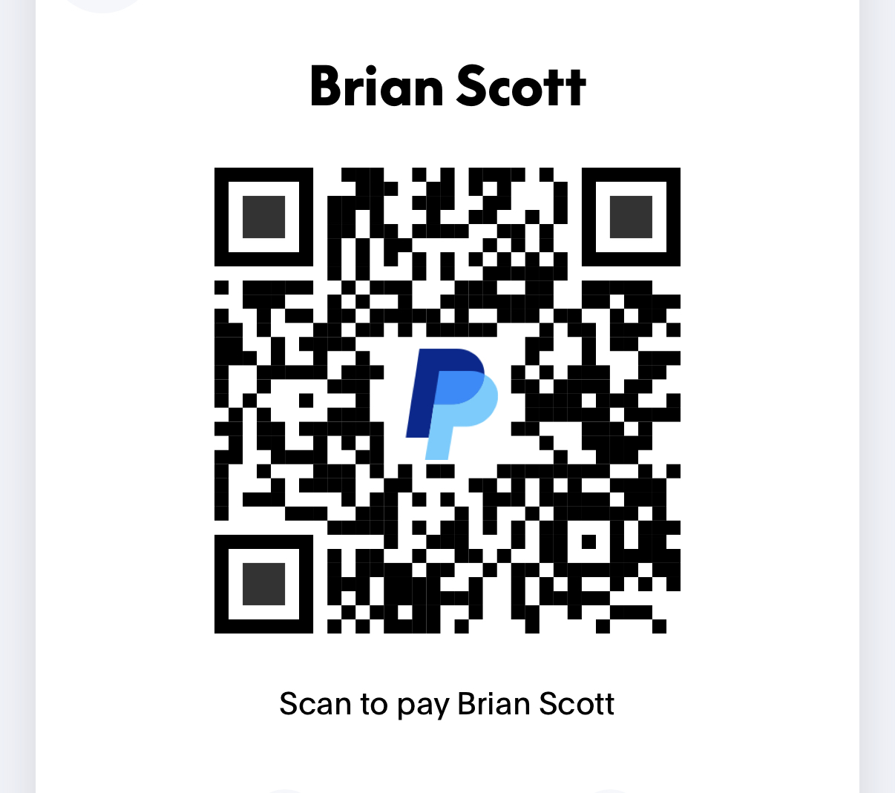

<!-- ============================================================= -->
<!--  DRAFT BUDDY — README                                         -->
<!--  A live draft war room for Sleeper. Free, no login, no build. -->
<!-- ============================================================= -->

<p align="center">
  
</p>

<p align="center">
  
</p>

<p align="center">
  
  
  
  
  
</p>

<p align="center">
  <a href="https://zeekeey-jpeg.github.io/Sleeper_Draft_Buddy/"><b>Open the app</b></a> ·
  <a href="#-quick-start">Quick start</a> ·
  <a href="#-how-the-engine-thinks">How the engine thinks</a> ·
  <a href="#-tip-jar">Tip jar</a>
</p>

---

## What is Draft Buddy?

Draft Buddy is the co-pilot seat for your fantasy football draft. You still draft in Sleeper
like you always do — Draft Buddy sits next to it, watches every pick land in real time, and
tells you who to take **and why**. Not a static cheat sheet that was already wrong by round 3.
A live read of *this* room: who's running on which position, which tier is about to fall off a
cliff, and the odds your guy is still there when the snake comes back around.

It's one HTML file, some vanilla JavaScript, and nothing else. No account, no server, no
install, no "sign in with Sleeper." Paste a draft link, pick your seat, and it starts talking.

---

## ⚡ Features

**Attach to any draft in about five seconds**
- Paste a Sleeper **mock draft** or **league draft** link (or its raw ID) — that's the whole setup.
- Seat picker loads the **real team names** straight from the draft, so you click a name, not a number.
- Teams, rounds, roster slots, and scoring all come from the draft itself. Nothing to configure.

**The pick, argued out loud**
- **THE PICK** card: headshot, team, last season's PPR points and PPG, this season's projection,
  superflex ADP, tier, and bye week.
- A plain-English **why** — "only 2 tier-1 RBs left," "startable QB supply dries up around pick 78,"
  "value falling: ADP 41, still here at pick 56."
- **PATH B / PATH C** — the best alternatives at other positions, argued the same way, plus a peek
  at what your *next* turn probably looks like if you take this guy now.
- **Position lock** — already sold on RB? Tap RB and get the top three with a **BEST BET** call.

**Survival odds (the good part)**
- Every candidate carries a **"% chance he makes it back to you"** meter for your next pick.
- It's not ADP arithmetic — it walks every pick between now and your turn, asks whether *that*
  team actually needs the position, and factors in how fast the room is eating that position.
- The model recalibrates to **your** room live, so keeper leagues and fast rooms don't break it.

**Run detection that pages you**
- Positional **run pressure meters** — green is a normal market, red means they're going fast.
- A persistent **🔥 RUN** alert with a one-tap "Lock RB" button. A run is a decision moment,
  not a toast you'll miss while you're looking at your phone.

**Situational awareness**
- **Gone since your last turn** — a live strip of every player who came off the board while you
  were away, hot positions flagged.
- **Bye-week coverage strip** — can you field a *full* lineup every single week, or does week 11
  leave a starter slot empty?
- **Watchlist (★)** to track your guys' survival odds, and **never-suggest (🚫)** for the player
  who personally wronged you in 2024. Both persist between sessions.
- **Full draft board** — the whole snake grid, keepers marked, your column highlighted.
- Injury designations, fresh news, trending adds, and mass-drop warnings surface on the card.

**Built for the real thing**
- **Superflex / 2QB aware** throughout — ADP, replacement level, and roster needs all know that
  a spare WR does not cover a SFLEX slot.
- **Keepers** load and display, and the engine accounts for the picks they occupy.
- **Adaptive polling (150–500ms)** — picks appear near-instantly, and it speeds up as your turn approaches.
- Everything runs **client-side**, talking straight to Sleeper's public read-only API.
  No login, no backend, no analytics. Your watchlist and settings live in your browser's localStorage.

---

## 🚀 Quick start

### Option A — just open it (nothing to install)

**[zeekeey-jpeg.github.io/Sleeper_Draft_Buddy](https://zeekeey-jpeg.github.io/Sleeper_Draft_Buddy/)**

That's it. It's a static page; it loads and it's ready.

### Option B — run it locally

Clone or download the repo, then double-click:

| Platform | File |
|---|---|
| Windows | `run.cmd` |
| macOS / Linux | `run.sh` |

Each one serves the folder locally and opens your browser at the app. (Nothing gets installed
and nothing phones home — it's just a local static file server.)

```bash
git clone https://github.com/Zeekeey-jpeg/Sleeper_Draft_Buddy
cd Sleeper_Draft_Buddy
./run.sh          # Windows: run.cmd
```

### Then, in the app

1. Click **Enter Your Draft** — mocks and league drafts are the same door.
2. Paste your Sleeper draft link — `https://sleeper.com/draft/nfl/123456789012345678` — or just the long ID.
3. Pick your seat from the grid (team names are already filled in).
4. Draft in Sleeper. Draft Buddy does the rest.

> ### ⚠️ One caveat worth knowing
> **Mocks started from the Sleeper phone app's lobby are invisible to Sleeper's public API.**
> They aren't published anywhere Draft Buddy can reach, so there's no link to paste and nothing
> to attach to. Start your mock from **sleeper.com → Mock Draft in a browser** instead — that
> gives you a real `sleeper.com/draft/nfl/...` URL, and everything works. Real league drafts are
> fine either way.

---

## 🧠 How the engine thinks

No black box. Here's the whole chain, in order:

**1. Projections, scored under *your* league's rules.**
Season projections get re-scored using the league's actual scoring settings — every scoring key
that matches a projected stat contributes. A TE-premium league and a standard league produce
different numbers from the same player. Injury designations discount season-long value (an
"Out" costs real weeks; a preseason "Questionable" is noise).

**2. VORP — value over replacement.**
Raw points don't tell you anything. What matters is the gap between a player and the guy you'd
be starting instead. So the engine works out how many players at each position actually get
started league-wide (counting flex and superflex realistically), finds the replacement-level
player at each position, and measures everyone against *that*.

**3. A market blend against superflex ADP.**
Pure season-total VORP undervalues quarterbacks in 2QB leagues — you can't stream a QB when
everyone needs two, so the market prices that scarcity harder than season points imply. The
engine blends its own valuation with where the market actually drafts, which keeps it honest
in both directions: it still catches value falling past its ADP, but it doesn't hand you a
board that no real room would ever produce.

**4. Tiers, by where the cliffs are.**
Positions get cut into tiers at the real gaps in projected points, not at round numbers. This
is what turns "take the best player" into "take *him*, because he's the last one before the
drop-off."

**5. Survival probability to your next pick.**
The headline number. For each candidate, the engine walks every single pick between now and
your next turn and asks: does *this* team, with *this* roster, plausibly take him? Teams with
two quarterbacks already stop threatening quarterbacks. Keeper-occupied slots don't threaten
anyone. The whole model is recalibrated live against how this specific room is drafting, which
is what makes it work in keeper leagues where everyone goes earlier than redraft ADP says.

**6. Run pressure and supply deadlines.**
Over a rolling window, the engine compares how many players at each position *actually* went
against how many *should* have gone. A genuine burst reads as a run and pulls everyone's
expected pick earlier. Separately it estimates when each position's startable supply runs dry —
and if that happens before your next couple of turns while you still need a starter there,
this window gets flagged as urgent.

**7. The recommendation.**
Value now, minus what you can realistically expect to still be there later, weighted by your
actual roster needs, positional scarcity, deadline pressure, and bye-week coverage. The winner
becomes **THE PICK**; the runners-up become **PATH B** and **PATH C**, each with its own
argument and a preview of what your following pick likely looks like.

It's deterministic: the same room state always produces the same advice. No dice, no vibes.

---

## ❓ FAQ

**Is this allowed?**
Yes. Draft Buddy only *reads* from Sleeper's public API — the same endpoints that power public
draft boards. It never makes a pick, never automates anything, and never writes a single byte
back. Every selection is still yours, entered by you, in Sleeper. It's a second screen, not a bot.

**Does it see my Sleeper account?**
No. There's no login, no OAuth, no password field, no token. It reads public draft data and
that's all. Nothing you do in the app leaves your browser — your watchlist, your banned players,
and your settings live in localStorage on your own machine. There's no backend to send anything
to, and no analytics of any kind.

**What league types work?**
Snake drafts, including third-round-reversal. Redraft and **keeper** leagues (keepers load onto
the board and the engine accounts for the picks they consume). **Superflex / 2QB is fully
supported** and treated as a first-class format rather than an afterthought — roster math, ADP,
and replacement levels all understand it. Auction drafts are not supported.

**Do I need to keep it open the whole draft?**
Nope. If it closes, reopen it, re-attach, and confirm your seat — the entire pick history
refetches in one poll and you're back where the room is.

---

## 💸 Donations

<p align="center">
  <b>Draft Buddy is free. Forever. No ads, no upsell, no "pro" tier.</b><br/>
  If you find it useful, any donation is appreciated — it keeps the upgrades coming.
</p>

<p align="center">
  <a href="https://venmo.com/Brian-Scott-2">
    
  </a>
  <a href="https://www.paypal.me/brianscott31">
    
  </a>
</p>

<table align="center"><tr>
  <td align="center"><br/><sub>Venmo — scan with your phone</sub></td>
  <td align="center"><br/><sub>Card or PayPal — no account needed</sub></td>
</tr></table>

<p align="center">
  <sub>Or just hit the 🎁 button in the app — $1 / $5 / $10 / $20, one tap, no sign-up.</sub>
</p>

<p align="center">
  <sub>Not into donating? A ⭐ Star helps other people find it, and that works too.</sub>
</p>

---

<p align="center"><sub>
MIT licensed · Not affiliated with, endorsed by, or connected to Sleeper · Built by
<a href="https://www.helpmebim.com">HelpMeBIM</a>
</sub></p>
